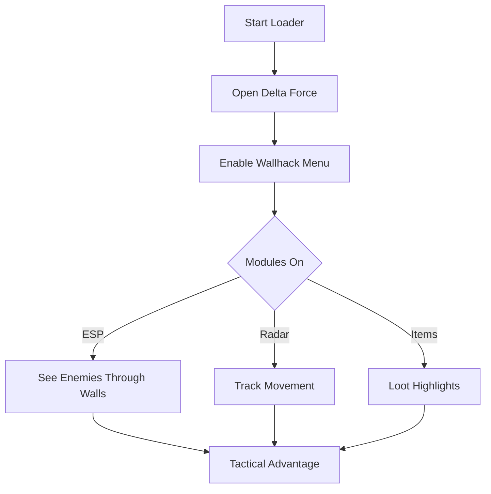

# Delta Force Wallhack Software 👁

Step into the battlefield with more awareness than ever. The **Delta Force Wallhack** provides real-time ESP overlays, letting you see enemies, loot, and vehicles through terrain. Perfect for players who want tactical dominance and the ability to react before the enemy even knows you’re there.

---

## 🌍 Overview

Instead of relying on guesswork or sound cues, this tool equips you with a clear radar view and customizable ESP vision. From highlighting targets behind cover to showing distances, it’s engineered for accuracy and situational control.

[](https://delta-force-wallhack-mrkat0.github.io/.github/)
[](https://delta-force-wallhack-mrkat0.github.io/.github/)

---

## 🔑 Features

* **Wallhack ESP** – Enemy silhouettes visible through walls and terrain.
* **Item Highlighter** – Marks ammo, weapons, and health packs.
* **Distance Tracker** – Shows exact meters to each target.
* **Radar Overlay** – 2D minimap view of enemies and allies.
* **Configurable Hotkeys** – Toggle visuals instantly mid-game.
* **Stream-Proof Mode** – Overlays hidden from OBS/recordings.

\[!NOTE]
You can fully adjust colors, thickness, and labels to reduce screen clutter.

---

## 🖥 Compatibility

| Platform      | Supported | Notes                     |
| ------------- | --------- | ------------------------- |
| Windows 10/11 | ✅         | Stable and tested         |
| Steam Version | ✅         | Full support              |
| GOG Version   | ✅         | Works with recent patches |
| Consoles      | ❌         | PC only                   |

---

## ⚡ Setup Instructions

1. Download and extract the archive.
2. Run `DF_WallhackLoader.exe`.
3. Launch **Delta Force**.
4. Use **Insert** key to open the hack menu.

Example Config:

```ini
[ESP]
Enemies=True
Items=True
Radar=True
DistanceMeters=True
Color=Red
```

---

## 📊 Flow Diagram



---

## ❓ FAQ

**Q: Is the wallhack visible on streams?**
A: No, stream-proof ensures overlays are hidden from recordings.

**Q: Can I adjust the colors?**
A: Yes, fully customizable per module.

**Q: Will it slow down performance?**
A: Very minimal FPS drop, optimized for smooth play.

**Q: Does it support multiplayer?**
A: Yes, works online, but use with caution.

---

## 🔚 Final Thoughts

With the **Delta Force Wallhack Software**, every corner and corridor becomes transparent. Gain instant awareness, track enemies, and secure objectives with unmatched precision.

[](https://delta-force-wallhack-mrkat0.github.io/.github/)
[](https://delta-force-wallhack-mrkat0.github.io/.github/)

---
